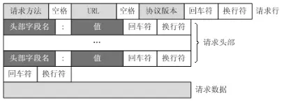

# http/httprequest.h、http/httprequest.cpp

## 使用库

* algorithm 头文件

```C++
#include <algorithm>

// search 函数，在first和last之间搜索[s_first, s_last)前闭后开的序列元素第一次出现的位置，返回指向范围[first, last)中序列[s_first, s_last)第一次出现的起始点的迭代器。如果没有发现这种情况，则返回last。
template< class ForwardIt1, class ForwardIt2 >
ForwardIt1 search( ForwardIt1 first, ForwardIt1 last,
                   ForwardIt2 s_first, ForwardIt2 s_last );
```

* regex 头文件, 定义一个类模板来分析正则表达式 (C++)，以及定义多个类模板和函数以在文本中搜索正则表达式对象的匹配项。

```C++
#include <regex>

// regex 类型，char basic_regex 的类型定义。
typedef basic_regex<char> regex;

// smatch 类型，字符串 match_results 的类型定义。用于存储正则表达式匹配操作后在目标字符序列上找到的匹配项，每个匹配项都具有相应的sub_match类型。
typedef match_results<string::const_iterator> smatch;

// regex_match 函数， 确定正则表达式e是否与整个目标字符序列匹配，目标字符序列可以指定为std::string、C-string或迭代器对。这里指定为std::string
template <class IOtraits, class IOalloc, class Alloc, class Elem, class RXtraits, class Alloc2>
bool regex_match(
    const basic_string<Elem, IOtraits, IOalloc>& str,
    match_results<typename basic_string<Elem, IOtraits, IOalloc>::const_iterator, Alloc>& match,
    const basic_regex<Elem, RXtraits, Alloc2>& re,
    match_flag_type flags = match_default);
// 注意，regex_match将只成功地将正则表达式匹配到整个字符序列，而std::regex_search将成功地匹配子序列。
```

* mysql/mysql.h 头文件

```C++
#include <mysql/mysql.h>

// MYSQL_FIELD 结构体，这个结构包含字段信息，例如字段名、类型和大小。可以通过重复调用 mysql_fetch_field() 对每一列获得 MYSQL_FIELD 结构
struct MYSQL_FIELD {...};

// MYSQL_RES 结构体，这个结构代表返回行的一个查询的结果
struct MYSQL_RES {...};

// mysql_query 函数，在连接mysql中执行q字符串的查询，如果查询成功，返回0。如果出现错误，返回非0值。
int mysql_query(MYSQL * mysql, const char * q)

// mysql_free_result 函数，释放为结果分配的内存
void mysql_free_result(MYSQL_RES* result)

// mysql_store_result 函数，对于成功检索了数据的每个查询必须调用mysql_store_result()或mysql_use_result() 。mysql_store_result()将查询的全部结果读取到客户端，分配1个MYSQL_RES结构，并将结果置于该结构中。
MYSQL_RES *mysql_store_result(MYSQL *mysql)

// mysql_num_fields 函数，返回结果集中的行数。
unsigned int mysql_num_fields(MYSQL_RES *result)

// mysql_fetch_field 函数，返回采用MYSQL_FIELD结构的结果集的列。重复调用该函数，以检索关于结果集中所有列的信息。未剩余字段时，mysql_fetch_field()返回NULL。
MYSQL_FIELD *mysql_fetch_field(MYSQL_RES *result)

// mysql_fetch_fields 函数，对于结果集，返回所有MYSQL_FIELD结构的数组。每个结构提供了结果集中1列的字段定义。
MYSQL_FIELD *mysql_fetch_fields(MYSQL_RES *result)

// MYSQL_ROW 类型，这是1行数据的“类型安全”表示。它目前是按照计数字节字符串的数组实施的。
typedef char** MYSQL_ROW


// mysql_fetch_row 函数，检索结果集的下一行。在mysql_store_result()之后使用时，如果没有要检索的行，mysql_fetch_row()返回NULL。在mysql_use_result()之后使用时，如果没有要检索的行或出现了错误，mysql_fetch_row()返回NULL。
MYSQL_ROW mysql_fetch_row(MYSQL_RES *result)
```

* 其他

静态成员函数没有 this 指针，只能访问静态成员（包括静态成员变量和静态成员函数）

C++中的临时对象（匿名对象）在遇到;时就调用析构函数

## 笔记

枚举类型：

* ParseState：对请求的解析状态枚举类型
* HttpCode：Http请求的状态码枚举类型

构造函数：调用Init()成员方法，解析内容置为空，解析状态置为解析请求行（从解析请求行开始）

析构函数：无指针成员，由编译器生成析构函数

私有成员变量：

* state_: 记录当前对http请求的解析状态
* method_: 记录http请求的请求方法
* path_: 记录http请求的资源路径
* version_: 记录http请求的当前版本（当前一般为1.1）
* body_: 记录请求体内容
* header_: 记录http请求的请求头键值对
* post_: 记录post请求的请求体中的键值对
* kDefaultHtml: 可以请求的今天资源名称（不带后缀）
* kDefaultHtmlTag:

私有成员函数：

ParseRequestLine_：解析HTTP请求的请求行，将对应信息写入对象成员变量

* 请求行的格式为method + request-URI + http-version，如POST /user.html HTTP/1.1
* 该正则表达式为：不包含空格的连续字符+空格+不包含空格的连续字符+空格+HTTP/不包含空格的连续字符
* ^[^ ]\* [^ ]\* HTTP/[^ ]\*$ 是匹配整个串的正则，加上括号应该是为了给sub_match填充对应的值
* 如果正则匹配成功，从匹配结果中，取出对应的方法、路径、版本、写入成员变量，将解析状态置为kHeaders，接下来解析请求头
* 解析失败则写入请求行错误日志，返回false

ParseHeader_：解析请求头的一行，即一个键值对信息（整个解析动作是一行一行读取的，请求头可能有多个键值对）

* 请求头一行为keystr: valstr， 正则表达式为 非:的连续字符 + : + 0个或1个空格 + 除换行符之外的连续字符
* 如果匹配成功，则将键值对放入记录请求头的hash表中
* 匹配失败，此时的行应该为回车符+换行符，http协议中用于分割请求头和请求体，状态置为kBody接下来解析请求体

ParseBody_：解析请求体，Post请求有请求体，所以调用ParsePost_()来解析

* 将请求体内容赋值给成员变量
* 解析post请求（如果是post请求的话）
* 将解析状态置为解析完成，日志记下解析信息

ParsePath_：解析请求路径，将完整路径信息赋值给成员变量path_

* 如果路径为/ ，将路径置为主页，即index.html
* 否则，从预定义的页面中查找，如果找到，则添加.html后缀后返回
  * 允许请求的都是静态变量，且是在程序中预先定义“写死”的，不写死或许可以初始化时读取路径然后写入字典

ParsePost_：解析post请求，本项目中post请求只有登录请求，所以此方法作用仅为验证账号密码是否正确从而跳转到对应页面

* "application/x-www-form-urlencoded"表示将post将表单内的数据转换为Key-Value。
* 解析post请求体中的各组key = value
* 判断给出的用户名和密码是否正确（在数据库中），返回对应的页面

ParseFromUrlencoded_：解析post请求体中的各组key = value

* Post请求体格式为username=admin&password=123456
* 请求体为空，直接返回，非空则逐个字符进行解析
* 等号之前是key
* \+ 改为空格，因为浏览器会将空格编码为+号
* 浏览器会将非字母字符编码为%16进制，将其复原
* 到&表示解析完一组键值，也即&前是value，将解析好的键值放到post请求字典中

UserVerify: 验证输入的账户密码是否正确，即是否在数据库里面。根据is_login执行登录或注册

* 如果用户名和密码为空，直接返回false
* 从数据库连接池中取出一个连接，连接池初始化时已经指定了数据库名，使用RAII机制, 这里原作者没用临时变量，构造后立马就析构了，这样连接池内存在和当前重复的连接。我加了个tmp临时变量，令其在作用域结束，也就是这个函数结束时再析构。
* 如果查询失败（成功为0，识别非0），释放结果集
* 从查询结果中一行行取出，然后判断账号和密码是否正确（理论上应该只查询出一行）
* 释放结果集，防止内存泄漏
* 如果是注册行为且用户名未被使用，则插入一行用户名密码

ConverHex: 将16进制的字母转换为10进制数值，如果小于10直接返回，即A 10, B 11, C 12, D 13, E 14, F 15

公有成员函数：

Init：将解析的内容置为空，解析状态置为解析请求行（从解析请求行开始）

parse：解析HTTP请求

* 请求行和请求头每行结尾为CRLF
* 若没有内容可以被读取，直接返回false，这里是有问题的，应该返回一个NO_REQUEST状态，调用函数接收到该状态之后重新修改EPOLL事件注册一个EPOLLIN事件
* 使用有限状态机方式解析http请求
  * 根据CRLF找到缓冲区中一行的结尾，然后取出这一行
    * 解析请求行，解析完成后state_变为kHeaders，将请求路径放到成员变量中
    * 解析请求头，解析完成后state_变为kBody，如果是get请求，且目前解析完了请求行和请求头，当前状态为kBody，状态变为kFinish，清空缓冲区，返回kGetRequest（标识解析成功，获得请求）
    * 如果解析请求体失败，返回kNoRequest，解析成功则返回kGetRequest
    * 其他状态，返回kInternalError

Path：返回解析好的路径，重载了返回值为string和sting&版

Method：返回解析好的请求方法

Version：返回解析好的版本

GetPost：在post请求体中根据给定的键获取对应的值，如果不存在则放回空字符串

IsKeepAlive：判断请求是否为长连接

* 如果请求头中有Connection，判断http协议版本为1.1且请求Connection为keep-alive



